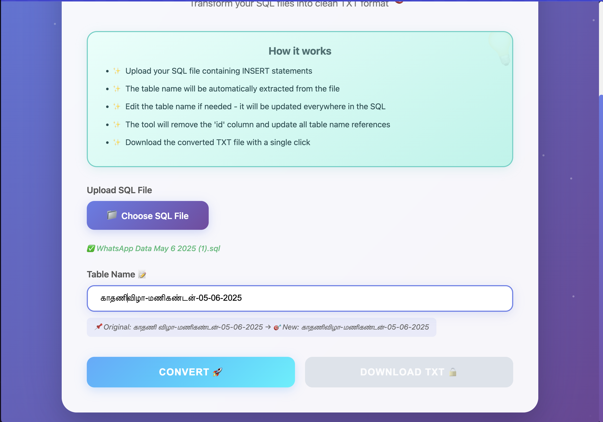
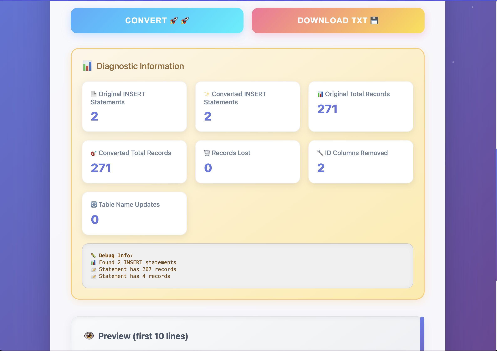

# SQL to TXT Converter ✨

A modern, beautifully designed web application that converts SQL INSERT statements to clean TXT format with intelligent ID column removal and table name management.


## 🚀 Features

### Core Functionality
- **🔄 SQL to TXT Conversion**: Seamlessly convert SQL files containing INSERT statements to clean TXT format
- **🆔 Automatic ID Column Removal**: Intelligently detects and removes 'id' columns from INSERT statements
- **📝 Dynamic Table Name Updates**: Change table names and have them updated throughout the entire file
- **👁️ Live Preview**: See the first 10 lines of your converted file before downloading
- **📊 Detailed Diagnostics**: Get comprehensive statistics about your conversion

### Design & User Experience
- **🎨 Stunning Modern UI**: Gradient backgrounds, glassmorphism effects, and smooth animations
- **✨ Interactive Animations**: Floating particles, hover effects, and transition animations
- **📱 Fully Responsive**: Works perfectly on desktop, tablet, and mobile devices
- **🌈 Visual Feedback**: Success states, loading indicators, and error handling with style

## 🛠️ How It Works

1. **Upload SQL File** 📁
   - Click "Choose SQL File" to select your SQL file
   - Supports `.sql` and `.txt` file formats

2. **Review Table Name** 📝
   - The tool automatically extracts the table name from your SQL
   - Edit the table name if needed - all references will be updated

3. **Convert** 🚀
   - Click the "Convert" button to process your file
   - Watch the beautiful loading animation while processing

4. **Download** 💾
   - Review the preview and diagnostic information
   - Click "Download TXT" to save your converted file

## 💻 Installation & Usage

### Option 1: Direct Browser Usage
Simply open the HTML file in any modern web browser:
```bash
# Clone the repository
git clone https://github.com/VisaganSP/sql-to-txt-converter.git

# Navigate to the project directory
cd sql-to-txt-converter

# Open in browser
open index.html  # macOS
# or
start index.html  # Windows
# or
xdg-open index.html  # Linux
```

### Option 2: Serve Locally
```bash
# Using Python
python -m http.server 8000

# Using Node.js
npx serve

# Then navigate to http://localhost:8000
```

## 🔧 Technical Details

### Technologies Used
- **HTML5**: Semantic markup structure
- **CSS3**: Advanced animations, gradients, and glassmorphism effects
- **Vanilla JavaScript**: No dependencies, pure JS for maximum performance

### Key Features Implementation
- **Smart SQL Parsing**: Handles complex INSERT statements with multiple value sets
- **Escape Character Handling**: Properly manages quotes and special characters
- **Memory Efficient**: Processes large files without performance issues
- **Cross-browser Compatible**: Works on Chrome, Firefox, Safari, and Edge

## 📸 Screenshots

### Main Interface


### File Upload State


### Conversion Results


## 🎯 Use Cases

- **Database Migration**: Clean up SQL exports for migration between systems
- **Data Processing**: Prepare SQL data for import into different applications
- **Backup Optimization**: Remove auto-increment IDs from backup files
- **Data Transformation**: Convert SQL format for compatibility with other tools

## 🤝 Contributing

Contributions are welcome! Feel free to:
- Report bugs
- Suggest new features
- Submit pull requests

## 📝 Example

### Input SQL:
```sql
INSERT INTO `காதணி விழா-மணிகண்டன்-05-06-2025` (`id`, `function_name`, `payer_name`, `amount`) VALUES
(1, 'காதணி விழா-மணிகண்டன்-05-06-2025', 'John Doe', '1000'),
(2, 'காதணி விழா-மணிகண்டன்-05-06-2025', 'Jane Smith', '2000');
```

### Output TXT (with table name changed to `காதணிவிழா-மணிகண்டன்-05-06-2025`):
```sql
INSERT INTO `காதணிவிழா-மணிகண்டன்-05-06-2025` (`function_name`, `payer_name`, `amount`) VALUES
('காதணிவிழா-மணிகண்டன்-05-06-2025', 'John Doe', '1000'),
('காதணிவிழா-மணிகண்டன்-05-06-2025', 'Jane Smith', '2000');
```

## 🏆 Features Breakdown

| Feature | Description | Status |
|---------|-------------|---------|
| ID Column Removal | Automatically removes 'id' columns | ✅ |
| Table Name Update | Global find and replace for table names | ✅ |
| Multi-line Support | Handles INSERT statements spanning multiple lines | ✅ |
| Special Characters | Supports Tamil and Unicode characters | ✅ |
| Error Handling | Graceful error messages with visual feedback | ✅ |
| Batch Processing | Process multiple INSERT statements | ✅ |
| Live Preview | See results before downloading | ✅ |

## 👤 Author

**Visagan S**

Made with ❤️ and lots of ☕

## 🙏 Acknowledgments

- Inspired by the need for clean data transformation tools
- Built for the developer community
- Special thanks to all contributors and users

---

<p align="center">
  <a href="#sql-to-txt-converter-">Back to top ⬆️</a>
</p>